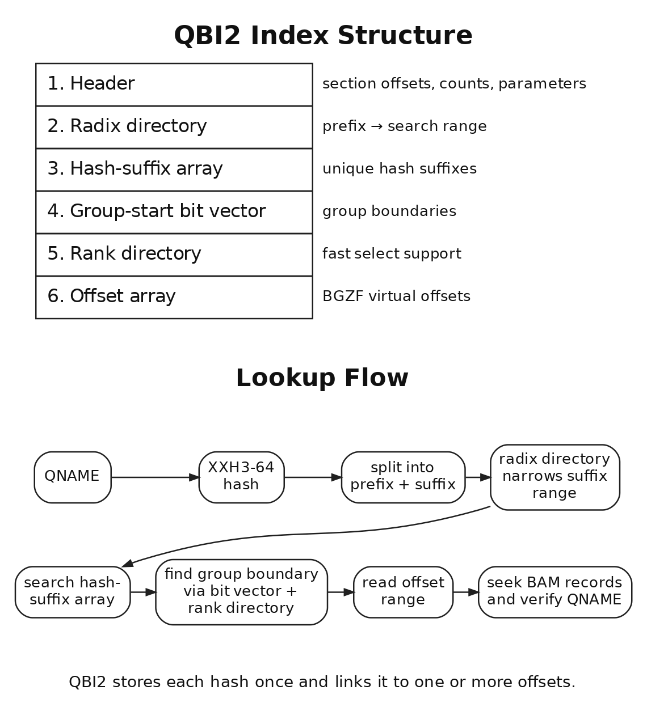
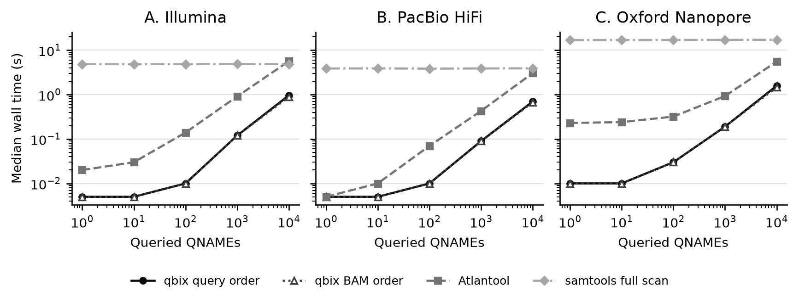

# Summary

BAM files are commonly sorted by genomic coordinate, which allows efficient access to records from a selected region [@li2009sam]. However, records belonging to one read may occur at different coordinates because of secondary or supplementary alignments. Examining a read as a whole therefore requires collecting its records by QNAME rather than by genomic position.

`qbix` adds QNAME lookup to an existing coordinate-sorted BAM file through a side index. It uses a fixed-width hash to locate candidate BAM records and then verifies their exact QNAMEs. The index can be built with a memory-efficient external sort. This allows alignments of a read identified in one genomic region to be collected from distant coordinates and used for detailed inspection, realignment, local assembly, and other read-centered analyses.

# Statement of need

Coordinate-based analysis often identifies a read at a genomic region of interest, but the next step is to examine the read as a whole. Other records with the same QNAME may describe a distant breakpoint, an alternative mapping, or another segment of a chimeric alignment. This is especially important for long reads that span complex rearrangements or sequences that are poorly represented in the reference genome.

QNAME lookup connects analysis of a genomic region with read-centered analysis. After a coordinate-based analysis identifies a read of interest, its QNAME can retrieve every BAM record for that read. These records support detailed read inspection, realignment to candidate sequences, local assembly, and construction of read--locus graphs. The same access is useful when reads are grouped by haplotype or base-modification pattern.

`samtools view -N` can extract records that match a list of QNAMEs [@danecek2021twelve]. However, it must scan the entire BAM file even when only a few reads are requested. This makes it slow for large BAM files. `qbix` is designed to retrieve all records belonging to specified QNAMEs from an existing coordinate-sorted BAM file.

# State of the field

BAI and CSI, the index formats commonly used with BAM files, index genomic coordinates but not QNAMEs. A queryname-sorted BAM can support QNAME lookup through a sparse index that uses the BAM file itself [@kojix2026bni]. However, many tools that process BAM files expect coordinate-sorted input, so a separate coordinate-sorted BAM usually remains necessary.

For coordinate-sorted BAM files, `bri` introduced an index that stores complete QNAME strings together with BGZF virtual offsets [@simpson2019bri]. Atlantool stores complete QNAMEs and offsets in a BGZF-compressed data file and places a sparse upper-level index above it [@rath2025atlantool].

`qbix` also adds a side index to a coordinate-sorted BAM, but it does not store complete QNAME strings. Each QNAME is represented by a fixed-width hash, and candidate records are checked against their actual QNAMEs in the BAM file. Each hash is stored once, while its associated offsets are kept in a separate array. The index size therefore does not depend on QNAME length, and the search key is not repeated for multiple records belonging to the same QNAME.

# Software design

## QBI index structure

A QBI file contains a 128-byte header and five data sections: a radix directory, a hash-suffix array, a group-start bit vector, a rank directory, and an offset array. The header records the position and size of each section, the BAM record count, the number of unique hashes, the radix parameters, and information about the source BAM file.

Each 64-bit QNAME hash `h` is divided into a radix prefix formed by the high `P` bits and a hash suffix formed by the remaining bits. The radix directory records the start and end positions in the hash-suffix array for each prefix. The hash-suffix array stores the suffix of each unique hash once, in the order of the original 64-bit hashes. QBI currently supports `P = 8`, `P = 12`, and `P = 16`.

The offset array stores one 64-bit BGZF virtual offset for each BAM record. The offsets are ordered by hash and then by virtual offset within each hash group. One hash may correspond to several offsets.

The group-start bit vector marks the start of each hash group in the offset array. One bit corresponds to each offset: the first offset in a group is marked with 1 and the others with 0. One additional sentinel bit marks the end of the final group. The rank directory accelerates `select1` on this bit vector. It stores the cumulative number of set bits before each 512-bit block; `select1` first locates the relevant block and then examines at most eight 64-bit words within it.

{width=100%}

During lookup, the QNAME hash is divided into its prefix and suffix. The radix directory identifies the relevant range of the hash-suffix array, and binary search is limited to that range. When a hash is found, the group-start bit vector and rank directory give the start and end positions of its offset group.

`qbix` reads the candidate BAM records through htslib [@bonfield2021htslib] and compares their actual QNAMEs. This ensures that only the correct records are returned, even when hash collisions occur.

## Memory-efficient construction

`qbix` scans the BAM file once and distributes fixed-width `(hash, offset)` records into temporary files according to the high bits of the hash. Each temporary file is sorted independently and then processed in prefix order to build the QBI index. Peak memory use therefore depends mainly on the largest bucket sorted at one time, rather than on the total number of BAM records.

The sorted records are processed once. Each offset is written, while suffixes and group boundaries are recorded only when the hash changes. The rank and radix directories are built in the same pass, without retaining all hashes and offsets in memory.

## Lookup and interfaces

`qbix` provides query-order and BAM-order output modes. Query-order mode reads QNAMEs incrementally and reports results in the same order. BAM-order mode sorts the candidate offsets to reduce random seeks when many QNAMEs are requested.

QNAMEs can be supplied as arguments, from a file, or through standard input, and results are written as SAM or BAM. `qbix` can remove repeated queries, record missing QNAMEs, and is also available through Rust and C APIs.

# Evaluation

Measurements used chromosome 21 subsets extracted with `samtools view -bh` from three public HG002 alignment BAM files: GIAB Illumina HiSeq 2x250 Novoalign, GIAB PacBio HiFi Revio 48x (BioProject PRJNA1028149), and Oxford Nanopore R10.4.1 SUP from ONT Open Data. The Illumina source header declared `SO:unsorted`; its chromosome subset was therefore sorted again with SAMtools before measurement. The resulting BAM sizes and record counts were 1.52 GiB and 11,145,955 records for Illumina, 962.3 MiB and 133,605 records for PacBio HiFi, and 4.90 GiB and 545,839 records for Oxford Nanopore.

Benchmarks ran on Ubuntu Linux 26.04 with an AMD Ryzen 7 5700X (8 cores, 16 threads), 60 GiB RAM, and a Samsung 870 QVO SATA SSD using qbix 0.0.9, SAMtools/HTSlib 1.24, and Atlantool release `release-983975f`. QBI was built with `P = 16`, one BGZF thread, one sorting thread, a 512 MiB sorting-memory setting, and eight bucket bits. Index values are medians of three builds; lookup values are medians of five independently sampled query sets generated with seed 20260730. The BAM was read once before timing, and the filesystem cache was not explicitly cleared. Timings below the 0.01 s timer resolution are reported as `<0.01 s`. Commands, manifests, query checksums, and per-replicate results are recorded by the benchmark workflow in `paper/work`.

## Index construction

Table 1 reports index construction measurements for the chromosome 21 subsets. Peak temporary-disk use was sampled every 0.25 s while each tool ran; a zero value means that no transient file was observed at that sampling interval.

| Dataset | Tool | Build (s) | RSS (MiB) | Temp (MiB) | Index (MiB) |
|:--|:--|--:|--:|--:|--:|
| Illumina | qbix | 13.58 | 22.5 | 170.1 | 119.0 |
|  | Atlantool | 29.99 | 717.4 | 105.9 | 103.9 |
| PacBio HiFi | qbix | 4.11 | 8.9 | 1.9 | 2.3 |
|  | Atlantool | 8.71 | 291.7 | 0.0 | 1.4 |
| ONT | qbix | 17.98 | 21.3 | 8.0 | 6.8 |
|  | Atlantool | 33.88 | 542.2 | 10.4 | 11.2 |

On the PacBio HiFi chromosome 21 subset, a separate three-build comparison in the same environment gave median build times of 4.11 s for QBI1 and 4.13 s for QBI2 with `P = 16`. The corresponding index sizes were 2.0 MiB and 2.3 MiB. At this subset size, the fixed radix directory makes QBI2 slightly larger than QBI1.

## End-to-end lookup

The scaling curves show the different cost profiles of indexed lookup and a full BAM scan. qbix was fastest or tied for fastest throughout the measured range. Its time increased with the number of present QNAMEs, whereas `samtools view -N` remained nearly constant because it scanned the complete input for every query set. Atlantool also avoided a full scan, but increased more rapidly than qbix on these datasets.

{width=100%}

Table 2 reports representative times from the same present-QNAME measurements. The qbix column uses query order and the SAMtools column uses a full scan. Timings include index lookup, BAM access, QNAME verification, and SAM formatting to `/dev/null`. The complete benchmark also includes query sets of 10 and 1,000 QNAMEs.

| Dataset | QNAMEs | qbix (s) | Atlantool (s) | SAMtools (s) |
|:--|--:|--:|--:|--:|
| Illumina | 1 | <0.01 | 0.02 | 4.85 |
|  | 100 | 0.01 | 0.14 | 4.86 |
|  | 10,000 | 0.96 | 5.66 | 4.85 |
| PacBio HiFi | 1 | <0.01 | <0.01 | 3.87 |
|  | 100 | 0.01 | 0.07 | 3.84 |
|  | 10,000 | 0.70 | 3.06 | 3.90 |
| ONT | 1 | 0.01 | 0.23 | 16.93 |
|  | 100 | 0.03 | 0.32 | 16.97 |
|  | 10,000 | 1.58 | 5.54 | 17.16 |

For 10,000 present QNAMEs, BAM-order mode reduced qbix time to 0.89 s for Illumina, 0.67 s for PacBio HiFi, and 1.47 s for Oxford Nanopore. For 10,000 absent QNAMEs, query-order lookup took `<0.01 s`, `<0.01 s`, and 0.01 s, respectively. The corresponding Atlantool times were 2.78 s, 2.09 s, and 2.35 s, while `samtools view -N` took 4.86 s, 3.83 s, and 16.94 s.

Correctness was checked against a complete `samtools view -N` scan after normalizing record order and SAM optional-tag order. For the 10,000-QNAME sets, qbix query-order, qbix BAM-order, Atlantool, and SAMtools produced identical record counts and SHA-256 hashes: 19,971 records and `8ed699da...27d8e8` for Illumina, 10,167 records and `e414c34d...bd4b34` for PacBio HiFi, and 15,594 records and `336cbbab...885d1` for Oxford Nanopore. All four methods returned zero records for the absent-QNAME sets.

# Research impact statement

`qbix` adds read-name lookup while keeping the coordinate-sorted BAM used for region-based access. It can pass all alignments of a read identified in a genomic region to downstream analysis without requiring a second queryname-sorted BAM.

This manuscript does not claim external scholarly adoption. Its current contributions are a documented one-to-many index, exact BAM-level QNAME verification, memory-efficient construction, and a reproducible evaluation.

# Availability

`qbix` is available from [GitHub](https://github.com/kojix2/qbix) and [crates.io](https://crates.io/crates/qbix) under the MIT license. Prebuilt binaries are distributed through GitHub Releases, and releases are archived on Zenodo [@kojix2026qbix]. The repository includes the QBI format specification, benchmark scripts, raw measurements, tests, and examples.

# AI usage disclosure

OpenAI ChatGPT (GPT-5.6 Thinking, accessed July--August 2026) was used for implementation suggestions, code review, test planning, documentation, manuscript restructuring, and English revision. It also assisted discussion of the index design and interpretation of results supplied by the author. The model did not execute the reported benchmarks. The author made the architectural decisions and reviewed and validated all AI-assisted code and text.

# Acknowledgements

The author thanks the developers of `bri` for the read-name-index concept and the htslib and SAMtools communities for the BAM and BGZF infrastructure used by `qbix`.

# References
